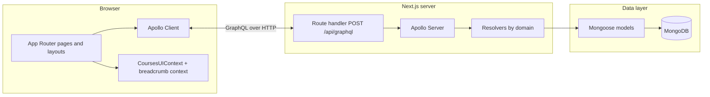
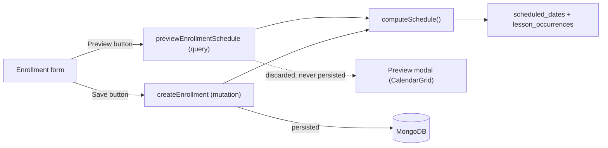
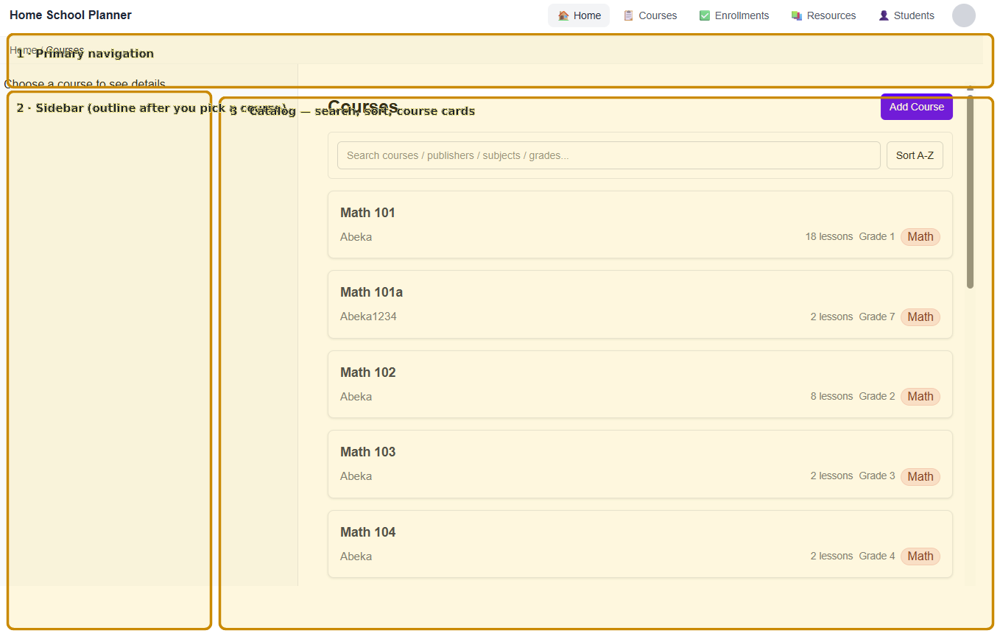
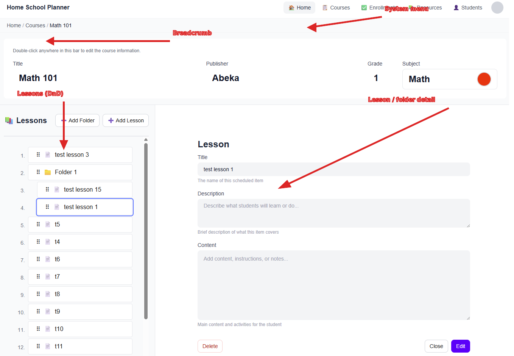
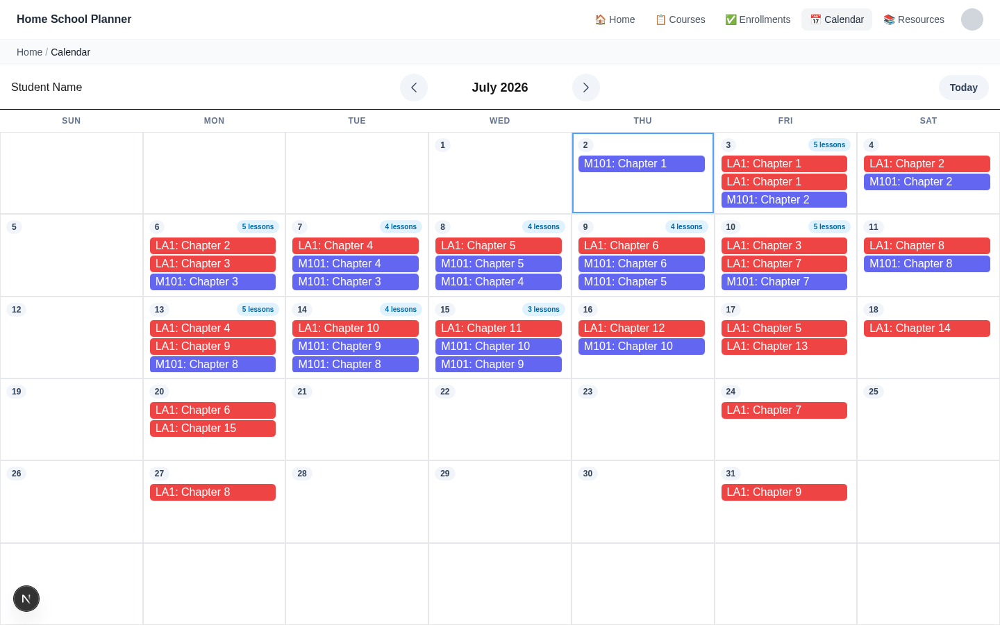
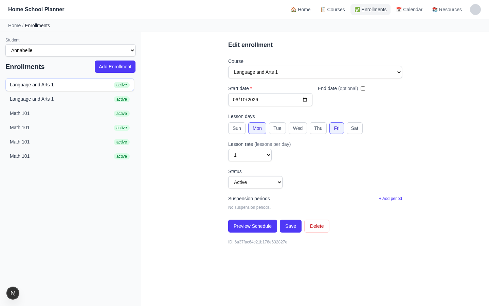

# Homeschool Planner

A full-stack **Next.js** application for managing a homeschool curriculum: draggable lesson/folder outlines, enrollment scheduling with a live calendar preview, a month-view calendar with per-student auto-rescheduling, shared resources (subjects, publishers), and a **GraphQL API** over **MongoDB**. The codebase is structured so the UI, API boundary, and data model stay explicit—useful as a portfolio piece for discussing system design in interviews.

---

## System architecture

The app follows a classic **three-tier** shape adapted to the App Router: interactive UI in the browser, a single **GraphQL** HTTP endpoint on the server, and **MongoDB** accessed only through **Mongoose** models.



### Layers and responsibilities

| Layer | Role in this project |
|--------|----------------------|
| **Presentation** | React **client components**, Tailwind styling, [`@dnd-kit`](https://docs.dndkit.com/) for outline drag-and-drop. The [`/courses`](src/app/courses/) area uses a **layout** split: sidebar (`CoursesSidebar`, tree) + main (`CourseDetails`, forms). |
| **Client data fetching** | **Apollo Client** ([`src/utils/apolloClient.ts`](src/utils/apolloClient.ts)) targets **`/api/graphql`**, with cache for queries and mutations that refetch course lists after saves. |
| **Cross-cutting UI state** | [**`CoursesUIContext`**](src/app/courses/CoursesUIContext.tsx) holds the selected course, outline selection, **form mode** (course vs lesson vs folder; view vs edit vs new), and coordination hooks (`runCourseFlush`, `runDetailFlush`) so navigating away or switching context can persist or validate the active form safely. |
| **API** | One **Apollo Server** instance mounted via [`@as-integrations/next`](https://github.com/apollographql/apollo-server-integration-next) in [`src/app/api/graphql/route.ts`](src/app/api/graphql/route.ts). **Lazy MongoDB connection** runs in the GraphQL context on first request (`mongoose.connect` when `readyState === 0`). |
| **Schema & resolvers** | SDL-style **typeDefs** under [`src/app/api/graphql/schema/typedefs/`](src/app/api/graphql/schema/typedefs/). Resolvers are split by domain ([`courseResolvers`](src/app/api/graphql/resolvers/courseResolvers.ts), [`resourceResolvers`](src/app/api/graphql/resolvers/resourceResolvers.ts)) and merged with [`mergeGraphQLResolvers`](src/app/api/graphql/schema/mergeResolvers.ts) so each module can own its `Query` / `Mutation` / type fields without overwriting siblings. |
| **Persistence** | [**Mongoose**](https://mongoosejs.com/) schemas in [`src/models/`](src/models/). Courses embed a **nested `lessonTree`** (lessons and folders as subdocuments with recursive `children`). Publishers and subjects are separate collections, referenced from each course. |

### Course outline model (embedded tree)

The outline is **not** normalized into separate “Lesson” collection rows for the tree editor. Instead, each [`Course`](src/models/Course.ts) document stores `lessonTree` as a **recursive array** of nodes (`kind: lesson | folder`), validated in Mongoose (e.g. non-empty titles). GraphQL exposes this tree via DTO helpers ([`lessonTreeDto.ts`](src/app/api/graphql/lib/lessonTreeDto.ts)): resolver output maps Mongo shapes to API-friendly IDs and nesting; mutations map client input back to Mongo subdocuments.

**Why embed the tree:** fewer round-trips for reorder/reparent operations, transactional consistency with the parent course document, and simpler mental model for a planner-style outline. A tradeoff is that very large trees grow a single document (acceptable for typical homeschool course sizes).

### Client outline sync

The sidebar tree and the lesson/folder forms must agree on the latest structure after drag-and-drop or draft rows. The UI keeps a **`lessonTreeSourceRef`** (see [`CoursesUIContext`](src/app/courses/CoursesUIContext.tsx)) alongside React state so saves read the same tree the outline renderer uses, avoiding stale structures after optimistic UI updates.

### Calendar, enrollments & scheduling

An **enrollment** binds a student to a course on a recurring schedule (weekdays, week interval, optional suspension periods, optional end date). Creating one requires turning that schedule description into two parallel arrays stored on the [`Enrollment`](src/models/Enrollment.ts) document: `scheduled_dates` (every calendar date the course meets) and `lesson_occurrences` (one entry per date, carrying lesson content and a `pending | completed | skipped` status). The two arrays are paired **by index** — `lesson_occurrences[i].sequence` always matches the 1-based position of `scheduled_dates[i]` — which keeps the lookup O(1) instead of needing a join.



**Why `computeSchedule` is a shared, pure function:** generating that schedule is identical work whether you're previewing it or actually saving it, so [`computeSchedule`](src/app/api/graphql/lib/enrollmentUtils.ts) (wrapping `flattenLessonTree`, `generateLessonOccurrences`, `generateScheduledDates`) is called from both [`createEnrollment`](src/app/api/graphql/resolvers/enrollmentResolvers.ts) and `previewEnrollmentSchedule` in the same resolver file. The preview path runs the exact computation, formats it into the same `DayView`/`MonthView` shape the live calendar uses, and simply never writes to the database — so what the user previews is guaranteed to match what saving would produce, with no separate "preview logic" to drift out of sync.

**Where DRY was deliberately *not* applied:** `calendarMonthView` (in [`calendarResolvers.ts`](src/app/api/graphql/resolvers/calendarResolvers.ts)) does its own date-matching instead of reusing the preview's pairing logic. It has different concerns — multiple enrollments per request, filtering to a requested month, and reconciling `completed`/`skipped` status against live data — that `computeSchedule`'s single-enrollment, freshly-generated output doesn't have to deal with. Forcing both through one abstraction would have added branching to satisfy the simpler case rather than removing real duplication.

**Component reuse vs. data-fetching strategy:** the month grid (`CalendarGrid` / `DayCell` / `MonthTopBar`, under [`src/app/calendar/components/`](src/app/calendar/components/)) is shared **as-is** between the live `/calendar` page and the enrollment [`PreviewCalendar`](src/app/enrollments/components/PreviewCalendar.tsx) modal — same rendering, same month-navigation UI. What differs is fetching: the live calendar re-runs its GraphQL query every time the visible month changes, because saved lesson data can change underneath it (a lesson gets marked complete, another enrollment is added). The preview modal fetches the **entire** projected schedule once on open and filters it client-side when you click prev/next — correct because a not-yet-saved schedule can't change out from under the user mid-preview, so there's nothing to refetch.

**Status workflow:** each lesson cycles through `pending → completed | skipped`, tracked independently per lesson (not per occurrence — a `lesson_rate` ≥ 1 day can bundle multiple lessons into one occurrence, and each still completes on its own), editable from a popover on the month view (double-click a lesson). Valid transitions are data, not branching logic — a `statusActions` lookup (`{ pending: [...], completed: [...], skipped: [...] }`) drives which buttons render, so adding or renaming a status only touches one map instead of every place that renders a button.

**Auto-rescheduling (lazy check-on-load):** when either `calendarMonthView` or `calendarDayView` is queried, `processOverdueLessons` runs first — before the resolver fetches calendar data. It scans all active enrollments for the student and finds the first pending occurrence whose scheduled date has passed: past days are always considered overdue; today is only considered overdue after a configurable per-student cutoff time (`lesson_cutoff_time` on the [`Student`](src/models/Student.ts) model, defaulting to `"20:00"`). When overdue lessons are found, the overdue dates are spliced out of `scheduled_dates` and the same count of new dates is regenerated from today using the enrollment's existing weekday/interval/suspension pattern — preserving the lesson sequence without touching `lesson_occurrences`. A background cron job was considered but rejected: the app is opened daily, so the reschedule fires silently on the first calendar view and is imperceptible in latency (in-memory array scan, DB write only when overdue lessons are actually found).

**Known gaps in the reschedule logic (as of 2026-08-04):**
- **Completed lessons are not fully protected from being overwritten.** `processOverdueLessons` splices `scheduled_dates` from the first overdue index to the *end* of the array and regenerates it, without checking whether a later occurrence contains an already-`completed` lesson — that occurrence's `scheduled_dates` slot can still get silently reassigned. The same applies to `updateEnrollment`'s schedule-changed branch when weekdays/start_date/etc. are edited without a `lesson_rate` change. **Mitigated but not resolved:** since completion moved to per-lesson tracking, Month View now places a completed lesson by its own `completed_date` rather than the occurrence's `scheduled_dates` slot, so this no longer causes a *visible* misplacement — but the underlying invariant still isn't enforced at the data layer. **Invariant that must hold once fully fixed:** a `completed` lesson's scheduled date is a historical fact and must never be rewritten by any recompute path.
- **No way to undo a false-positive reschedule.** If a lesson was actually done on time but just not marked complete before cutoff, the ripple above still fires, and marking it complete afterward doesn't undo the postponement it caused for every later lesson — because `updateOccurrenceStatus` only ever touches the one lesson's `status`/`completed_date`, never `scheduled_dates`. The planned fix adds a second, frozen-except-on-deliberate-edit `original_scheduled_dates` field (refreshed only by intentional `updateEnrollment` schedule edits, never by auto-reschedule) as the baseline to detect drift against, plus an explicit prompt at mark-complete time when drift is detected ("was this really late, or was it done on time?") that can collapse the ripple back out when the answer is the latter.

### Scope note (portfolio honesty)

Authentication and multi-tenant isolation are **out of scope** in this repo; the GraphQL route is suitable for a trusted single-user or demo deployment. A production extension would add auth middleware, field-level authorization, and possibly splitting read-heavy analytics from the embedded outline pattern.

---

## Screenshots

Annotated captures help reviewers map UI quickly: the catalog shot uses **numbered amber outlines**; the course-detail shot uses **red arrows** and short labels for system menu, breadcrumb, outline, and detail pane. Unlabeled originals stay in [`docs/screenshots/`](docs/screenshots/) for replacing captures later.

### [`/courses`](http://localhost:3000/courses) — course list

Main planner shell: top navigation (Home, Courses, Enrollments, Resources, Students), breadcrumbs, course catalog with search and sort, and **Add Course**. After you pick a course, the left panel shows the lesson outline and the right panel shows lesson or folder details.



### `/courses` — course selected (outline + lesson detail)

With a course open: **system menu** (top), **breadcrumb** trail under it, **lessons tree** (left, drag-and-drop), and **lesson or folder detail** (right).



### `/calendar` — month view

Month grid showing scheduled lessons per day with subject color coding, today highlighted, and navigation between months. Double-clicking a lesson opens a detail popover with status actions (complete / skip / reopen).



### `/enrollments` — enrollment management

Two-panel layout: student selector and enrollment list on the left, enrollment form on the right. Supports schedule configuration (weekdays, lesson rate, suspension periods) with a **Preview Schedule** button to visualise the projected calendar before saving.



_Add more captures under [`docs/screenshots/`](docs/screenshots/). Regenerate labels with the helper script [`docs/screenshots/annotate-screenshots.sh`](docs/screenshots/annotate-screenshots.sh) after updating the plain PNGs._

---

## Quick start

**Requirements:** Node.js 20+, npm, and a running MongoDB instance.

```bash
npm install
cp .env.example .env
# Set MONGODB_URI in .env (see .env.example comments).
npm run dev
# Open http://localhost:3000 — use the top nav “Courses” or go to /courses.
```

**Docker (Mongo + dev container)** — see [`docker-compose.yaml`](docker-compose.yaml). The `.env.example` notes using host `db` for `MONGODB_URI` when the DB service is named `db`.

```bash
docker compose up -d db
# Point MONGODB_URI at your local Mongo, then:
npm run dev
```

---

## Main routes

| Path | Purpose |
|------|---------|
| [`/courses`](src/app/courses/page.tsx) | Course picker, lesson/folder outline, lesson & folder forms. |
| [`/enrollments`](src/app/enrollments/page.tsx) | Bind a student to a course on a recurring schedule; preview the projected calendar before saving. |
| [`/calendar`](src/app/calendar/page.tsx) | Month view (`?view=month`) and day view (`?view=day&date=...`) of a student's scheduled lessons. |
| [`/testing`](src/app/testing/page.tsx) | Standalone drag-and-drop tree prototype (dnd-kit). |
| [`/resources`](src/app/resources/page.tsx) | Resource management pages (subjects, publishers, students). |

---

## Tech stack

- Next.js (App Router), React, TypeScript  
- Tailwind CSS  
- Apollo Client + Apollo Server (`/api/graphql`)  
- Mongoose + MongoDB  
- [@dnd-kit](https://docs.dndkit.com/) for outline drag-and-drop  
- Vitest for unit testing  

---

## Key directories

| Area | Location |
|------|-----------|
| Courses UI & layout | [`src/app/courses/`](src/app/courses/) — [`LessonForm`](src/app/courses/components/LessonForm.tsx), [`CoursesSidebar`](src/app/courses/components/CoursesSidebar.tsx), [`CoursesUIContext`](src/app/courses/CoursesUIContext.tsx), GraphQL documents under [`src/app/courses/api/`](src/app/courses/api/). |
| Enrollments UI | [`src/app/enrollments/`](src/app/enrollments/) — form + list in [`page.tsx`](src/app/enrollments/page.tsx), [`PreviewCalendar`](src/app/enrollments/components/PreviewCalendar.tsx) modal. |
| Calendar UI | [`src/app/calendar/`](src/app/calendar/) — [`CalendarGrid`](src/app/calendar/components/CalendarGrid.tsx), [`DayCell`](src/app/calendar/components/DayCell.tsx) (lesson popover + status actions), [`MonthTopBar`](src/app/calendar/components/MonthTopBar.tsx). |
| Scheduling logic | [`src/app/api/graphql/lib/enrollmentUtils.ts`](src/app/api/graphql/lib/enrollmentUtils.ts) — pure functions: `flattenLessonTree`, `generateLessonOccurrences`, `generateScheduledDates`, `computeSchedule`. |
| App-wide providers | [`src/app/app-providers.tsx`](src/app/app-providers.tsx) — wraps courses UI + breadcrumb providers. |
| GraphQL route & schema | [`src/app/api/graphql/`](src/app/api/graphql/). |
| Mongoose models | [`src/models/`](src/models/). |
| Apollo browser client | [`src/utils/apolloClient.ts`](src/utils/apolloClient.ts). |
| DnD sandbox | [`src/app/testing/`](src/app/testing/). |

---

## Scripts

| Command | Description |
|---------|-------------|
| `npm run dev` | Development server (webpack). |
| `npm run build` | Production build. |
| `npm run start` | Serve production build. |
| `npm test` | Run unit tests (Vitest, watch mode). |
| `npm run lint` | ESLint. |
| `npm run format` | Prettier write. |

---

More on Next.js: [nextjs.org/docs](https://nextjs.org/docs).
