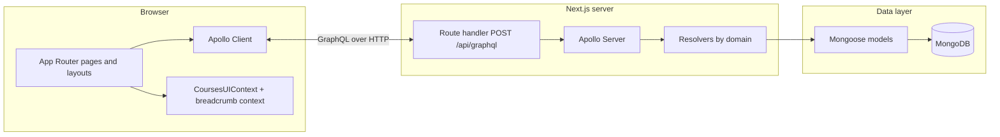

# Homeschool Planner

A full-stack **Next.js** application for planning homeschool courses: draggable lesson/folder outlines, rich lesson and folder detail panels, shared resources (subjects, publishers), and a **GraphQL API** over **MongoDB**. The codebase is structured so the UI, API boundary, and data model stay explicit—useful as a portfolio piece for discussing system design in interviews.

---

## System architecture

The app follows a classic **three-tier** shape adapted to the App Router: interactive UI in the browser, a single **GraphQL** HTTP endpoint on the server, and **MongoDB** accessed only through **Mongoose** models.



### Layers and responsibilities

| Layer | Role in this project |
|--------|----------------------|
| **Presentation** | React **client components**, Tailwind styling, [`@dnd-kit`](https://docs.dndkit.com/) for outline drag-and-drop. The [`/courses`](src/app/courses/) area uses a **layout** split: sidebar (`CoursesSidebar`, tree) + main (`CourseDetails`, forms). |
| **Client data fetching** | **Apollo Client** ([`src/utils/apolloClient.ts`](src/utils/apolloClient.ts)) targets **`/api/graphql`**, with cache for queries and mutations that refetch course lists after saves. |
| **Cross-cutting UI state** | [**`CoursesUIContext`**](src/app/courses/CoursesUIContext.tsx) holds the selected course, outline selection, **form mode** (course vs lesson vs folder; view vs edit vs new), and coordination hooks (`runCourseFlush`, `runDetailFlush`) so navigating away or switching context can persist or validate the active form safely. |
| **API** | One **Apollo Server** instance mounted via [`@as-integrations/next`](https://github.com/apollographql/apollo-server-integration-next) in [`src/app/api/graphql/route.ts`](src/app/api/graphql/route.ts). **Lazy MongoDB connection** runs in the GraphQL context on first request (`mongoose.connect` when `readyState === 0`). |
| **Schema & resolvers** | SDL-style **typeDefs** under [`src/app/api/graphql/schema/typedefs/`](src/app/api/graphql/schema/typedefs/). Resolvers are split by domain ([`courseResolvers`](src/app/api/graphql/resolvers/courseResolvers.ts), [`resourceResolvers`](src/app/api/graphql/resolvers/resourceResolvers.ts)) and merged with [`mergeGraphQLResolvers`](src/app/api/graphql/schema/mergeResolvers.ts) so each module can own its `Query` / `Mutation` / type fields without overwriting siblings. |
| **Persistence** | [**Mongoose**](https://mongoosejs.com/) schemas in [`src/models/`](src/models/). Courses embed a **nested `lessonTree`** (lessons and folders as subdocuments with recursive `children`). Publishers and subjects are separate collections, referenced from each course. |

### Course outline model (embedded tree)

The outline is **not** normalized into separate “Lesson” collection rows for the tree editor. Instead, each [`Course`](src/models/Course.ts) document stores `lessonTree` as a **recursive array** of nodes (`kind: lesson | folder`), validated in Mongoose (e.g. non-empty titles). GraphQL exposes this tree via DTO helpers ([`lessonTreeDto.ts`](src/app/api/graphql/lib/lessonTreeDto.ts)): resolver output maps Mongo shapes to API-friendly IDs and nesting; mutations map client input back to Mongo subdocuments.

**Why embed the tree:** fewer round-trips for reorder/reparent operations, transactional consistency with the parent course document, and simpler mental model for a planner-style outline. A tradeoff is that very large trees grow a single document (acceptable for typical homeschool course sizes).

### Client outline sync

The sidebar tree and the lesson/folder forms must agree on the latest structure after drag-and-drop or draft rows. The UI keeps a **`lessonTreeSourceRef`** (see [`CoursesUIContext`](src/app/courses/CoursesUIContext.tsx)) alongside React state so saves read the same tree the outline renderer uses, avoiding stale structures after optimistic UI updates.

### Scope note (portfolio honesty)

Authentication and multi-tenant isolation are **out of scope** in this repo; the GraphQL route is suitable for a trusted single-user or demo deployment. A production extension would add auth middleware, field-level authorization, and possibly splitting read-heavy analytics from the embedded outline pattern.

---

## Screenshots

Annotated captures help reviewers map UI quickly: the catalog shot uses **numbered amber outlines**; the course-detail shot uses **red arrows** and short labels for system menu, breadcrumb, outline, and detail pane. Unlabeled originals stay in [`docs/screenshots/`](docs/screenshots/) for replacing captures later.

### [`/courses`](http://localhost:3000/courses) — course list

Main planner shell: top navigation (Home, Courses, Enrollments, Resources, Students), breadcrumbs, course catalog with search and sort, and **Add Course**. After you pick a course, the left panel shows the lesson outline and the right panel shows lesson or folder details.


### `/courses` — course selected (outline + lesson detail)

With a course open: **system menu** (top), **breadcrumb** trail under it, **lessons tree** (left, drag-and-drop), and **lesson or folder detail** (right).


_Add more captures under [`docs/screenshots/`](docs/screenshots/). Regenerate labels with the helper script [`docs/screenshots/annotate-screenshots.sh`](docs/screenshots/annotate-screenshots.sh) after updating the plain PNGs._

---

## Quick start

**Requirements:** Node.js 20+, npm, and a running MongoDB instance.

```bash
npm install
cp .env.example .env
# Set MONGODB_URI in .env (see .env.example comments).
npm run dev
# Open http://localhost:3000 — use the top nav “Courses” or go to /courses.
```

**Docker (Mongo + dev container)** — see [`docker-compose.yaml`](docker-compose.yaml). The `.env.example` notes using host `db` for `MONGODB_URI` when the DB service is named `db`.

```bash
docker compose up -d db
# Point MONGODB_URI at your local Mongo, then:
npm run dev
```

---

## Main routes

| Path | Purpose |
|------|---------|
| [`/courses`](src/app/courses/page.tsx) | Course picker, lesson/folder outline, lesson & folder forms. |
| [`/testing`](src/app/testing/page.tsx) | Standalone drag-and-drop tree prototype (dnd-kit). |
| [`/resources`](src/app/resources/page.tsx) | Resource management pages (subjects, publishers, etc.). |

---

## Tech stack

- Next.js (App Router), React, TypeScript  
- Tailwind CSS  
- Apollo Client + Apollo Server (`/api/graphql`)  
- Mongoose + MongoDB  
- [@dnd-kit](https://docs.dndkit.com/) for outline drag-and-drop  

---

## Key directories

| Area | Location |
|------|-----------|
| Courses UI & layout | [`src/app/courses/`](src/app/courses/) — [`LessonForm`](src/app/courses/components/LessonForm.tsx), [`CoursesSidebar`](src/app/courses/components/CoursesSidebar.tsx), [`CoursesUIContext`](src/app/courses/CoursesUIContext.tsx), GraphQL documents under [`src/app/courses/api/`](src/app/courses/api/). |
| App-wide providers | [`src/app/app-providers.tsx`](src/app/app-providers.tsx) — wraps courses UI + breadcrumb providers. |
| GraphQL route & schema | [`src/app/api/graphql/`](src/app/api/graphql/). |
| Mongoose models | [`src/models/`](src/models/). |
| Apollo browser client | [`src/utils/apolloClient.ts`](src/utils/apolloClient.ts). |
| DnD sandbox | [`src/app/testing/`](src/app/testing/). |

---

## Scripts

| Command | Description |
|---------|-------------|
| `npm run dev` | Development server (webpack). |
| `npm run build` | Production build. |
| `npm run start` | Serve production build. |
| `npm run lint` | ESLint. |
| `npm run format` | Prettier write. |

---

More on Next.js: [nextjs.org/docs](https://nextjs.org/docs).
